# :sparkle: $\subseteq$ Commit Challenge 2024
Welcome to the annual $\subseteq$ Commit Challenge 2024! The goal is to make contributions and a commit every day to build something that can (hopefully) be considered meaningful and deployable by the end of the year 🚀

Our pages site is available on [GitHub Pages](https://nolanchai.dev/Commit-Challenge-2024/)

Our current participants:
- [Nolan](https://github.com/NolanChai)
- [Angela](https://github.com/angelatsai1214)
- [Sean](https://github.com/SheepTester)
- [Molly](https://github.com/mojeanmac)
- [Nick](https://github.com/nick-ls)
- [Sean](https://github.com/Sean1572)
- [Marcelo](https://github.com/dowhep)
- [Sam](https://github.com/sprestrelski) :fish:

# :exclamation: Rule
You must comit to main.

# :memo: Current To-Dos
Feel free to leave ideas here
- [X] Create better website so it links together a bunch of our projects here
- [ ] Create persistent navbar
- [X] Tracker to update and list number of daily commits per person
  - [X] Got it deployed on github pages
  - [X] Integrate into larger webpage
- [ ] Finish Image to Ascii thing :) check out [this](https://github.com/NolanChai/Commit-Challenge-2024/blob/main/ascii.html)
- [X] Finish gamedev workshop
- [ ] ocean
  - [ ] make the fish move around in the ocean
  - [ ] add seaweed and dots in the sand
- [X] fix leaderboard so there aren't duplicate ppl due to weird github username issues
# Roadmap
